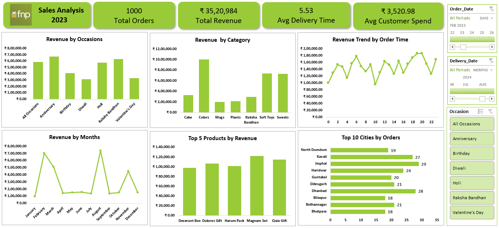

# FNP Sales Analysis Dashboard

This is an interactive Excel dashboard project created using Microsoft Excel to analyze sales performance and customer trends.

## Features
- Revenue Analysis
- KPI Cards
- Monthly Revenue Trends
- Top Products Analysis
- Top Cities by Orders
- Interactive Slicers

## Tools Used
- Microsoft Excel
- Pivot Tables
- Pivot Charts
- Slicers

## Files Included
- Fnp_Analysis.xlsx (Dashboard file)
- customers.csv (Customer dataset)
- orders.csv (Orders dataset)
- products.csv (Products dataset)

## Dashboard Preview

